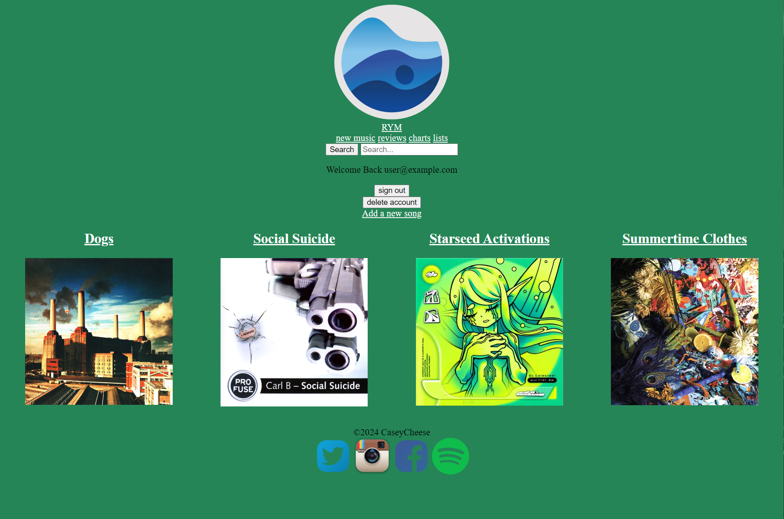

# Rate Your Music
This is an online music application where users can add and edit music.

# Screenshot

# Technologies Used
- JavaScript
- HTML
- CSS
- PostgresQL

# Libraries Used
- express
- express-ejs-layouts
- method-override
- express-session
- pg
- bcrpt

# Getting Started
1. Go to this website: https://
2. Create an account
3. Add music
4. See music details

# Features to Add
- Search bar
- Ability to create playlists
- Direct messaging between users
- "Forgot password" button
- Add option to choose between adding a single song or entire album
- Create reviews for songs
- Make a rating for a song
- Make the website design look prettier
- Add a charts page
- Add a latest reviews page

# Wireframes

